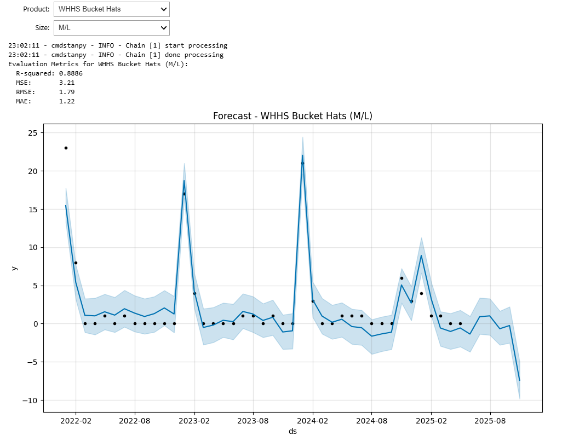
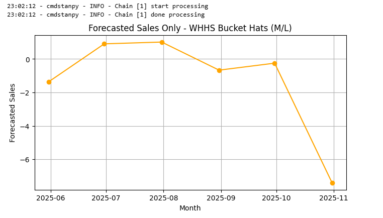
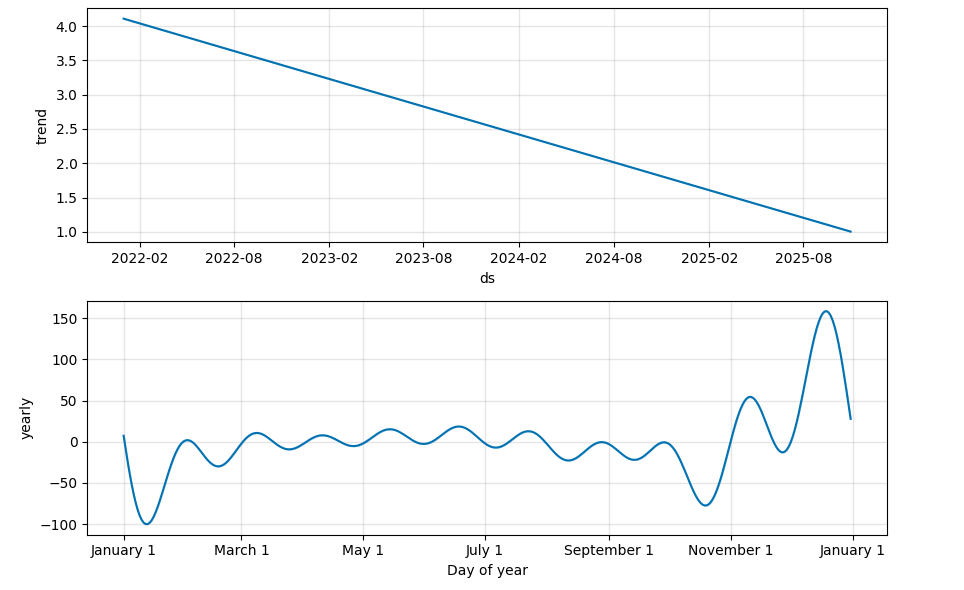

# Sales Forecasting Using Prophet

## Overview
This repository showcases a sales forecasting (time‑series) project for selected product–size combinations using Prophet (by Meta). It includes cleaned sales data, 6‑month sales forecasts, order suggestions derived from inventory data, and relevant visualizations. Data from three schools was scraped from Education Counts NZ for potential enhancements. Code and explanations are included throughout the notebooks.

## Features
- Cleaned and aggregated sales datasets
- 6‑month sales forecasts using Prophet
- Order suggestions informed by current inventory
- Visualizations and interactive forecasting plots

## Repository contents
- Data-Cleaning-and-EDA.ipynb
- prophet_sales_forecast.ipynb
- sales_forecast_and_order_logic.ipynb
- Web_Scraping.ipynb
- sales_data.csv
- sales_aggregated.csv
- inventory_data.csv

## How to run
1. Open the notebooks in your Jupyter environment.
2. Use `sales_aggregated.csv` as the primary input for sales prediction.
3. Run the cells to generate forecasts and order suggestions. Ensure the environment supports interactive widgets/plots to interact with the forecasting visualization.

## Data
- Source context: Sales data are aggregated for forecasting; supplemental information was scraped from Education Counts NZ (three schools) for potential future improvements.

## Outputs (provided)
The repository also provides generated outputs for quick review, including:
- Cleaned/aggregated datasets
- 6‑month sales forecasts
- Order recommendations
- Interactive plot (forecasted sales) - output1, output2, output3

If you prefer to regenerate these outputs yourself, run the notebooks above; they will reproduce the forecasts, recommendations, and figures.

## Context
This project was completed as part of an assessment. All rights reserved.
